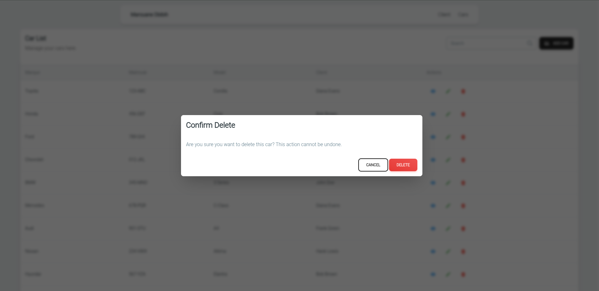
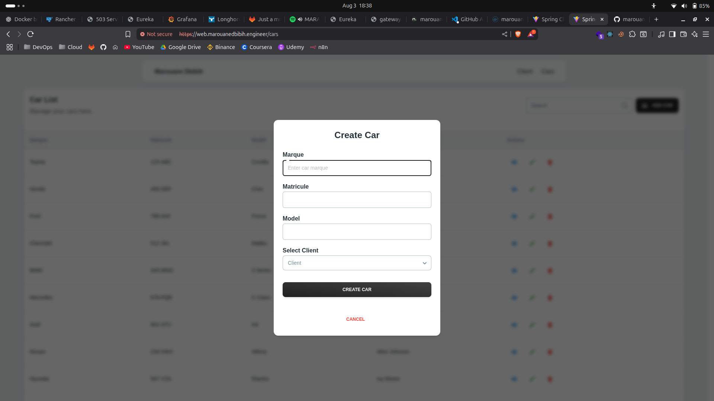
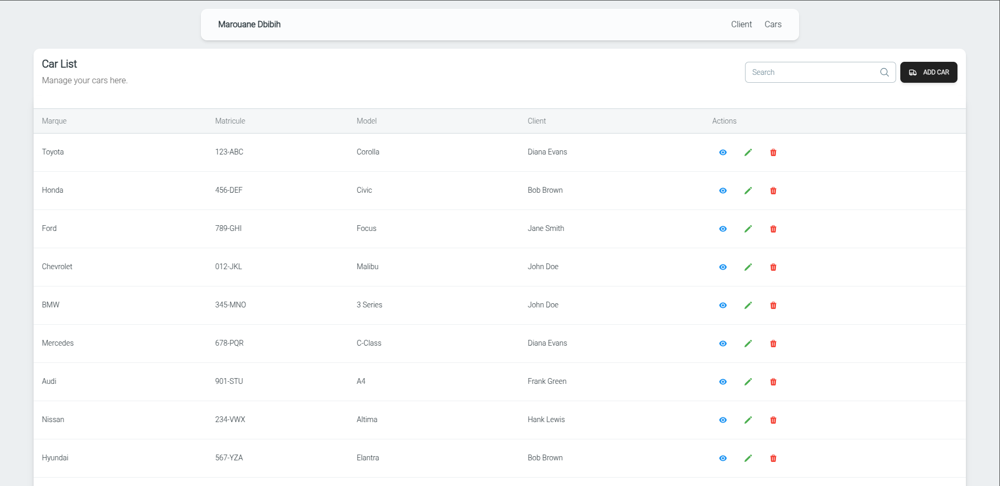
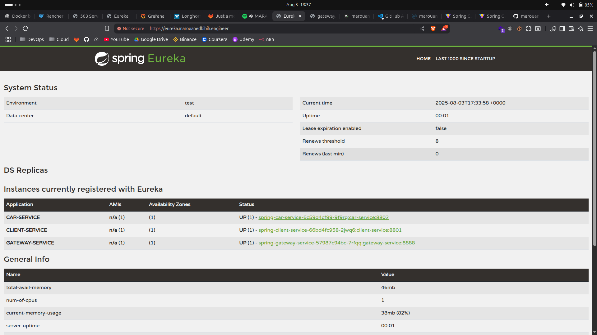

# Spring Cloud Microservices Application

## Table of Contents
1. [Introduction](#introduction)
2. [Architecture Overview](#architecture-overview)
3. [Microservices](#microservices)
4. [Technologies](#technologies)
5. [Project Structure](#project-structure)
6. [API Documentation](#api-documentation)
7. [Data Models](#data-models)
8. [Service Communication](#service-communication)
9. [Deployment](#deployment)
10. [How to Run this Project](#how-to-run-this-project)
11. [Configuration](#configuration)
12. [Monitoring and Health Checks](#monitoring-and-health-checks)
13. [License](#license)
14. [User Interfaces](#user-interfaces)

## Introduction

This is a modern Spring Cloud microservices application built with Spring Boot 3.4.0 and Spring Cloud 2024.0.0. The system demonstrates a complete microservices architecture with service discovery, API gateway, inter-service communication using OpenFeign, and a React frontend. The application manages cars and clients with a relationship between them, showcasing real-world microservices patterns and best practices.

## Architecture Overview

The application follows a distributed microservices architecture with the following key components:

```
┌─────────────────┐    ┌─────────────────┐    ┌─────────────────┐
│   React Web     │    │   API Gateway   │    │  Eureka Server  │
│   Application   │◄───┤   (Port 8888)   │◄───┤   (Port 8761)   │
└─────────────────┘    └─────────────────┘    └─────────────────┘
                              │                         ▲
                              ▼                         │
                    ┌─────────────────┐                 │
                    │   Load Balancer │                 │
                    └─────────────────┘                 │
                              │                         │
                ┌─────────────┼─────────────┐          │
                ▼                           ▼          │
    ┌─────────────────┐                ┌─────────────────┐
    │ Client Service  │                │  Car Service    │
    │   (Port 8801)   │◄──────────────►│   (Port 8802)   │
    └─────────────────┘                └─────────────────┘
            │                                   │
            ▼                                   ▼
    ┌─────────────────┐                ┌─────────────────┐
    │ MySQL Database  │                │ MySQL Database  │
    │ (clients_db)    │                │  (cars_db)      │
    └─────────────────┘                └─────────────────┘
```

## Microservices

### 1. Eureka Server (Service Discovery)
- **Port**: 8761
- **Purpose**: Service registry and discovery
- **Framework**: Spring Cloud Netflix Eureka
- **Key Features**:
  - Service registration and discovery
  - Health monitoring
  - Load balancer integration
  - Dashboard UI for service monitoring

### 2. API Gateway
- **Port**: 8888
- **Purpose**: Single entry point for all client requests
- **Framework**: Spring Cloud Gateway
- **Key Features**:
  - Request routing to appropriate microservices
  - CORS configuration
  - Load balancing
  - Service discovery integration

**Route Configuration**:
```yaml
routes:
  - id: client-service
    uri: lb://CLIENT-SERVICE
    predicates:
      - Path=/api/clients/**,/api/client/**
  - id: car-service  
    uri: lb://CAR-SERVICE
    predicates:
      - Path=/api/cars/**,/api/car/**
```

### 3. Client Service
- **Port**: 8801
- **Purpose**: Manages client entities and operations
- **Database**: MySQL (clients_db)
- **Framework**: Spring Boot with JPA
- **Key Features**:
  - CRUD operations for clients
  - RESTful API endpoints
  - MySQL database integration
  - Service registration with Eureka

**Endpoints**:
- `GET /api/clients` - Get all clients
- `GET /api/client/{id}` - Get client by ID
- `POST /api/client` - Create new client
- `PUT /api/client/{id}` - Update client
- `DELETE /api/client/{id}` - Delete client

### 4. Car Service
- **Port**: 8802
- **Purpose**: Manages car entities and client relationships
- **Database**: MySQL (cars_db)
- **Framework**: Spring Boot with JPA and OpenFeign
- **Key Features**:
  - CRUD operations for cars
  - Inter-service communication with Client Service via OpenFeign
  - RESTful API endpoints
  - Client relationship management

**Endpoints**:
- `GET /api/cars` - Get all cars with client details
- `GET /api/car/{id}` - Get car by ID
- `POST /api/car` - Create new car
- `PUT /api/car/{id}` - Update car
- `DELETE /api/car/{id}` - Delete car

## Technologies

### Backend Technologies
- **Spring Boot 3.4.0**: Main framework for microservices
- **Spring Cloud 2024.0.0**: Microservices infrastructure
- **Spring Cloud Netflix Eureka**: Service discovery
- **Spring Cloud Gateway**: API gateway
- **Spring Cloud OpenFeign**: Declarative HTTP client for inter-service communication
- **Spring Data JPA**: Data persistence layer
- **MySQL 8.0**: Primary database
- **Java 21**: Programming language
- **Maven**: Build and dependency management
- **Lombok**: Boilerplate code reduction

### Frontend Technologies
- **React 18**: Frontend framework
- **TypeScript**: Type-safe JavaScript
- **Vite**: Build tool and dev server
- **Material Tailwind**: UI component library
- **Axios**: HTTP client for API communication

### DevOps & Infrastructure
- **Docker**: Containerization
- **Docker Compose**: Multi-container application orchestration
- **Kubernetes**: Container orchestration (via Helm charts)
- **Helm**: Kubernetes package manager
- **NGINX**: Web server for production frontend
- **Prometheus**: Metrics and monitoring (configured)
- **Grafana**: Monitoring dashboards (configured)

## Project Structure

```plaintext
devops-ms/
├── car/                          # Car microservice
│   ├── src/main/java/
│   │   └── org/marouanedbibih/car/
│   │       ├── CarApplication.java
│   │       └── modules/
│   │           ├── car/          # Car domain
│   │           │   ├── Car.java
│   │           │   ├── CarDTO.java
│   │           │   ├── CarREQ.java
│   │           │   ├── CarRepository.java
│   │           │   ├── CarService.java
│   │           │   ├── CarMapper.java
│   │           │   └── CarREST.java
│   │           └── client/       # Client integration
│   │               ├── ClientDTO.java
│   │               ├── ClientREQ.java
│   │               └── ClientService.java (Feign Client)
│   └── pom.xml
│
├── client/                       # Client microservice
│   ├── src/main/java/
│   │   └── org/marouanedbibih/client/
│   │       ├── ClientApplication.java
│   │       └── module/
│   │           ├── Client.java
│   │           ├── ClientDTO.java
│   │           ├── ClientREQ.java
│   │           ├── ClientRepository.java
│   │           ├── ClientService.java
│   │           ├── ClientMapper.java
│   │           └── ClientREST.java
│   └── pom.xml
│
├── eureka/                       # Service discovery
│   ├── src/main/java/
│   │   └── org/marouanedbibih/eureka/
│   │       └── EurekaApplication.java
│   └── pom.xml
│
├── gateway/                      # API Gateway
│   ├── src/main/java/
│   │   └── org/marouanedbibih/gateway/
│   │       ├── GatewayApplication.java
│   │       └── config/
│   │           ├── GatewayConfig.java
│   │           └── CorsConfig.java
│   └── pom.xml
│
├── web/                          # React frontend
│   ├── src/
│   │   ├── components/
│   │   ├── services/
│   │   ├── types/
│   │   └── contexts/
│   ├── package.json
│   └── Dockerfile
│
├── docker/                       # Docker configurations
│   ├── compose.yml
│   ├── .env.dev
│   └── init.sql
│
├── helm/                         # Kubernetes deployment
│   ├── Chart.yaml
│   ├── values.yaml
│   └── templates/
│
└── README.md
```

## API Documentation

### Client Service API

| Method | Endpoint | Description | Request Body | Response |
|--------|----------|-------------|--------------|----------|
| GET | `/api/clients` | Get all clients | - | `List<ClientDTO>` |
| GET | `/api/client/{id}` | Get client by ID | - | `ClientDTO` |
| POST | `/api/client` | Create new client | `ClientREQ` | `ClientDTO` |
| PUT | `/api/client/{id}` | Update client | `ClientREQ` | `ClientDTO` |
| DELETE | `/api/client/{id}` | Delete client | - | `void` |

### Car Service API

| Method | Endpoint | Description | Request Body | Response |
|--------|----------|-------------|--------------|----------|
| GET | `/api/cars` | Get all cars with client details | - | `List<CarDTO>` |
| GET | `/api/car/{id}` | Get car by ID | - | `CarDTO` |
| POST | `/api/car` | Create new car | `CarREQ` | `CarDTO` |
| PUT | `/api/car/{id}` | Update car | `CarREQ` | `CarDTO` |
| DELETE | `/api/car/{id}` | Delete car | - | `void` |

### Gateway Routes

All requests to the frontend go through the API Gateway at port 8888:

- **Client endpoints**: `http://localhost:8888/api/clients/**` → `CLIENT-SERVICE`
- **Car endpoints**: `http://localhost:8888/api/cars/**` → `CAR-SERVICE`

## Data Models

### Client Entity

```java
@Entity
@Table(name = "clients")
public class Client {
    @Id
    @GeneratedValue(strategy = GenerationType.IDENTITY)
    private Long id;
    private String name;
    private Float age;
}
```

### Car Entity

```java
@Entity
@Table(name = "cars")
public class Car {
    @Id
    @GeneratedValue(strategy = GenerationType.IDENTITY)
    private Long id;
    private String marque;      // Brand
    private String matricule;   // License plate
    private String model;
    private Long clientId;      // Foreign key to Client
}
```

### DTOs and Request Objects

**ClientDTO**:

```java
public record ClientDTO(Long id, String name, Float age) {}
```

**ClientREQ**:

```java
public record ClientREQ(String name, Float age) {}
```

**CarDTO**:

```java
public class CarDTO {
    private Long id;
    private String marque;
    private String matricule;
    private String model;
    private ClientDTO client;  // Populated via inter-service call
}
```

**CarREQ**:

```java
public record CarREQ(String marque, String matricule, String model, Long clientId) {}
```

## Service Communication

### Inter-Service Communication with OpenFeign

The Car Service communicates with the Client Service using OpenFeign for declarative HTTP client calls:

```java
@FeignClient(name = "CLIENT-SERVICE")
public interface ClientService {
    @GetMapping("/api/client/{id}")
    ClientDTO findById(@PathVariable("id") Long id);
    
    @GetMapping("/api/clients")
    List<ClientDTO> getAll();
    
    // Other CRUD operations...
}
```

### Service Discovery Flow

1. **Service Registration**: Each microservice registers itself with Eureka Server on startup
2. **Service Discovery**: Services discover each other through Eureka's service registry
3. **Load Balancing**: Gateway uses Eureka for load-balanced routing (`lb://SERVICE-NAME`)
4. **Health Monitoring**: Eureka monitors service health and removes unhealthy instances

## Deployment

### Development Environment (Docker Compose)

The application supports multiple deployment profiles:

```bash
# Start infrastructure only (MySQL + Eureka)
docker compose --profile infra up

# Start full development environment
docker compose --profile dev up --build

# Start production environment  
docker compose --profile prod up --build
```

### Production Environment (Kubernetes with Helm)

The application includes comprehensive Helm charts for Kubernetes deployment:

```bash
# Install with Helm
helm install devops-ms ./helm

# Install with custom values
helm install devops-ms ./helm -f custom-values.yaml

# Upgrade deployment
helm upgrade devops-ms ./helm
```

**Key Kubernetes Resources**:

- Deployments for each microservice
- Services for internal communication
- Ingress for external access
- ConfigMaps for configuration
- Secrets for sensitive data
- MySQL database with persistent volumes

## How to Run this Project

### Prerequisites

- **Java 21** or higher
- **Docker** and **Docker Compose**
- **Maven 3.8+** (for local development)
- **Node.js 18+** and **npm** (for frontend development)

### Quick Start with Docker Compose

1. **Clone the repository**:

   ```bash
   git clone https://github.com/marouanedbibih/devops-spring-cloud.git
   cd devops-spring-cloud
   ```

2. **Start the infrastructure services**:

   ```bash
   cd docker
   docker compose --profile infra up -d
   ```

3. **Wait for services to be ready**, then start the application services:

   ```bash
   docker compose --profile dev up --build
   ```

4. **Access the application**:
   - **Frontend**: <http://localhost:5173>
   - **API Gateway**: <http://localhost:8888>
   - **Eureka Dashboard**: <http://localhost:8761>
   - **Client Service**: <http://localhost:8801>
   - **Car Service**: <http://localhost:8802>

### Local Development Setup

1. **Start infrastructure services**:

   ```bash
   cd docker
   docker compose --profile infra up -d
   ```

2. **Run services individually**:

   ```bash
   # Terminal 1 - Eureka Server
   cd eureka
   ./mvnw spring-boot:run

   # Terminal 2 - Client Service
   cd client
   ./mvnw spring-boot:run

   # Terminal 3 - Car Service
   cd car
   ./mvnw spring-boot:run

   # Terminal 4 - Gateway
   cd gateway
   ./mvnw spring-boot:run

   # Terminal 5 - Frontend
   cd web
   npm install
   npm run dev
   ```

### Production Deployment

1. **Using Docker Compose**:

   ```bash
   cd docker
   docker compose --profile prod up -d
   ```

2. **Using Kubernetes**:

   ```bash
   # Install Helm chart
   helm install devops-ms ./helm

   # Check deployment status
   kubectl get pods
   kubectl get services
   ```

## Configuration

### Environment Variables

The application uses environment variables for configuration. Key variables:

#### Database Configuration

```bash
MYSQL_HOST=mysql
MYSQL_PORT=3306
MYSQL_ROOT_PASSWORD=root
DATABASE_NAME=clients_db
DATABASE_NAME_CAR=cars_db
DATABASE_USERNAME_CLIENT=client_user
DATABASE_PASSWORD_CLIENT=client_password
```

#### Service Configuration

```bash
EUREKA_SERVER_PORT=8761
EUREKA_INSTANCE_HOSTNAME=eureka
CLIENT_SERVICE_PORT=8801
CAR_SERVICE_PORT=8802
GATEWAY_SERVICE_PORT=8888
```

#### Application Profiles

- **default**: H2 in-memory database for quick testing
- **dev**: MySQL database for development
- **prod**: MySQL database with production optimizations

### Spring Boot Configuration

Each service has profile-specific configuration:

**application.yml** (default):

```yaml
spring:
  application:
    name: client-service
  datasource:
    url: jdbc:h2:mem:testdb
eureka:
  client:
    service-url:
      defaultZone: http://localhost:8761/eureka/
```

**application-dev.yml**:

```yaml
spring:
  datasource:
    url: jdbc:mysql://${MYSQL_HOST}:${MYSQL_PORT}/${DATABASE_NAME}
    username: ${DATABASE_USERNAME_CLIENT}
    password: ${DATABASE_PASSWORD_CLIENT}
```

## Monitoring and Health Checks

### Health Endpoints

All services expose Spring Boot Actuator endpoints:

- **Health Check**: `/actuator/health`
- **Info**: `/actuator/info`
- **Metrics**: `/actuator/metrics` (Car and Client services)
- **Gateway Routes**: `/actuator/gateway/routes` (Gateway only)

### Service Monitoring

- **Eureka Dashboard**: <http://localhost:8761>
  - View registered services
  - Monitor service health
  - Check service instances

### Observability Stack (Configured)

The project includes configuration for:

- **Prometheus**: Metrics collection
- **Grafana**: Monitoring dashboards  
- **Tempo**: Distributed tracing

## Troubleshooting

### Common Issues

1. **Services not registering with Eureka**:
   - Check network connectivity
   - Verify Eureka server is running
   - Check service configuration

2. **Database connection issues**:
   - Ensure MySQL is running
   - Verify database credentials
   - Check network connectivity

3. **Inter-service communication failures**:
   - Verify service registration in Eureka
   - Check OpenFeign configuration
   - Ensure services are healthy

### Useful Commands

```bash
# Check service logs
docker compose logs -f client-service

# Restart a specific service
docker compose restart car-service

# Check Eureka registered services
curl http://localhost:8761/eureka/apps

# Health check endpoints
curl http://localhost:8801/actuator/health
curl http://localhost:8802/actuator/health
```

## License

This project is licensed under the MIT License - see the [LICENSE](LICENSE) file for details.

## User Interfaces

The application provides a clean and user-friendly interface for both admins and users. Below are some key screenshots of the application:

### Delete Interface



### Form Interface



### List Interface



### Eureka Dashboard


